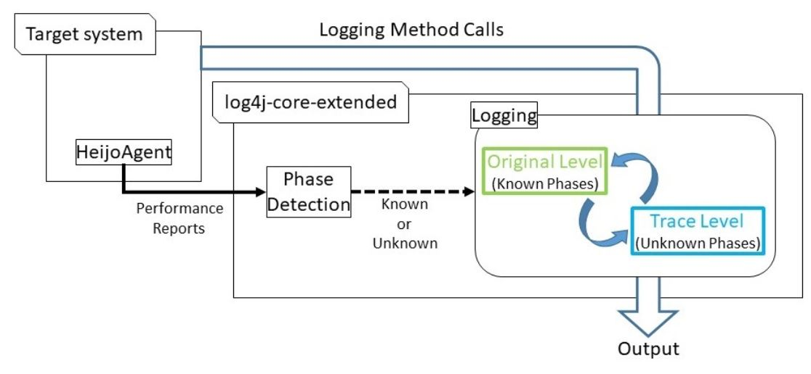

# projects
## Overview


## HeijoAgent
* A performance reporter for PADLA.
* It reports the execution time for each method in a fixed interval. 


## log4j-core-extended
* A main componet of PADLA. It is an extention of the log4j-core.
* It has two components: Phase Detection and Logging.
* Phase Detection component judges whether a phase of current interval is known or unknown using performance reports from the HeijoAgent.
* Logging component changes the log level according to the result of the Phase Detection.

## Getting started
### Running target system with "Learning" mode of PADLA
* For the "Learning" mode, follow the steps below
1. Replace log4j-core.jar of the target system with log4j-core-3.0.0-SNAPSHOT.jar.
2. Edit log4j2.xml to add an appender named "Learning". A sample is below:
```xml
<?xml version="1.0" encoding="UTF-8"?>
<!DOCTYPE project>
<Configuration status="off">
	
    <Properties>
        <Property name="format1">%d{yyyy/MM/dd HH:mm:ss.SSS} [%t] %-6p %c{10} %m%n</Property>
    </Properties>
	<Appenders>
	    <File name="Learning" fileName=[File Path]>
	      <PatternLayout pattern="%d{HH:mm:ss} [%t] %-5level %logger{36} - %msg%n"/>
	    </File>
		<Console name="Console" target="SYSTEM_OUT">
	      <PatternLayout pattern="%d{HH:mm:ss} [%t] %-5level %logger{36} - %msg%n"/>
	    </Console>
    </Appenders>

    <Loggers>
        <Root level="trace">
         <AppenderRef ref="Learning" level="info"/>
         <AppenderRef ref="Console" level="info"/>
        </Root>
    </Loggers>
</Configuration>
```
3. Add -javaagent option to include the Java agent with a JVM argument. A sample is below:
```bat
java -javaagent:"HeijoAgent.jar=target=target.jar,phaseOutput=vecs.txt,interval=5"  -jar sampleApp.jar
```
4. After you shutdown the target system with, you will get the learning data in vecs.txt with above setting.

### Running target system with "Adopter" mode of PADLA
 * For the "Adopter" mode, follow the steps below
1. Replace log4j-core.jar of the target system with log4j-core-3.0.0-SNAPSHOT.jar.
2. Edit log4j2.xml to add an appender named "Adopter". 
3. Add -javaagent option to include the Java agent with a JVM argument. A sample is below:
```bat
java -javaagent:"HeijoAgent.jar=target=target.jar,learningData=vectors.txt,bufferOutput=buffer.txt,buffer=300,interval=5"  -jar sampleApp.jar
```
4. If the target system performs an irregular behavior that is not exist in the learning data, PADLA will change the log level.
5. After you shutdown the target system, you will get log file(in [File Path]) and buffered logs in buffer.txt with above setting.
